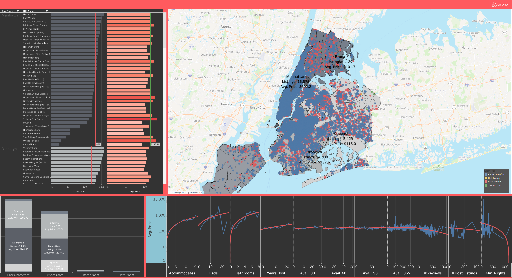

# Price Recommendation Feature for AirBnB
Nate DiRenzo

## Abstract
The goal of this project was to help AirBnB increase user engagement on their platform by proposing the implimentation of a price recommendation feature for hosts. I analyzed and visualized publicly available data using Tableau to support my recommendation, and articulate the potential value of my recommendation in business terms.

## Design
This project came about for a few reasons: First, I am an AirBnB host. Second, I believe the end of the COVID pandemic will lead to a surge in people travelling. And third, AirBnB's profit model relies on 3% service fees on both sides of a transaction happening through their website. I'm interested in understanding if more users transacting at marginally lower price points would increase or decrease AirBnB's net profit.

Practically speaking, this project is designed to generate meaningful insights about which variables in our dataset would be good candidates for features in a price prediction model and present those insights to business stakeholders in a compelling manner. The desired outcome is to get approval for additional work on the proposal.

## Data
The dataset used in this project contains 38,000+ AirBnB listings in NYC as of 6 January 2022. It was collected from [InsideAirBnB](http://insideairbnb.com/get-the-data.html).

Additionally, [Neighborhood Shapefiles](https://www1.nyc.gov/site/planning/data-maps/open-data/census-download-metadata.page) and [Borough Boundaries](https://data.cityofnewyork.us/City-Government/Borough-Boundaries/tqmj-j8zm) from the City of New York were used for spatial joins and grouping.

## Tools
- **Tableau** for ingestion, manipulation, interactive visualizations

## Communication
All Visualizations and Presentation Material can be found in my [Tableau Public Dashboard](https://public.tableau.com/app/profile/nate.direnzo/viz/NYCAirBnBWorkbook/Presentation)

